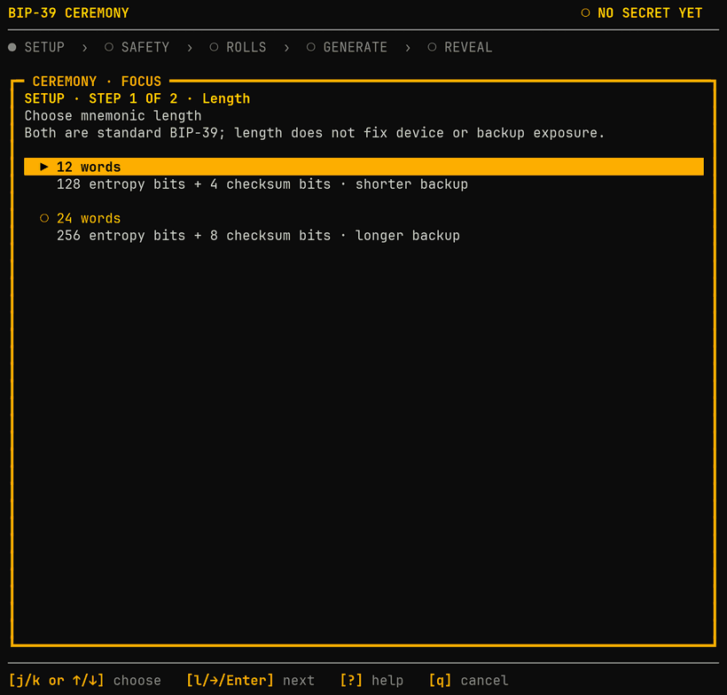
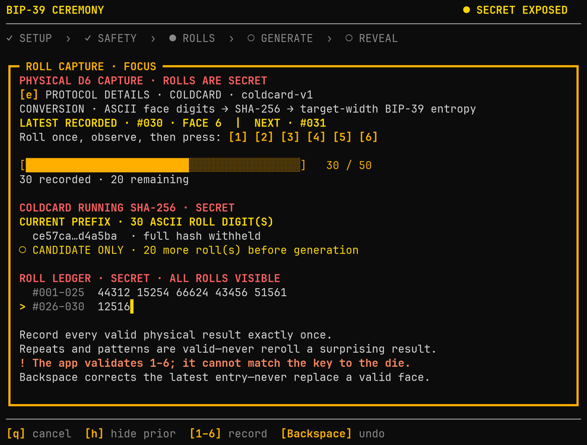
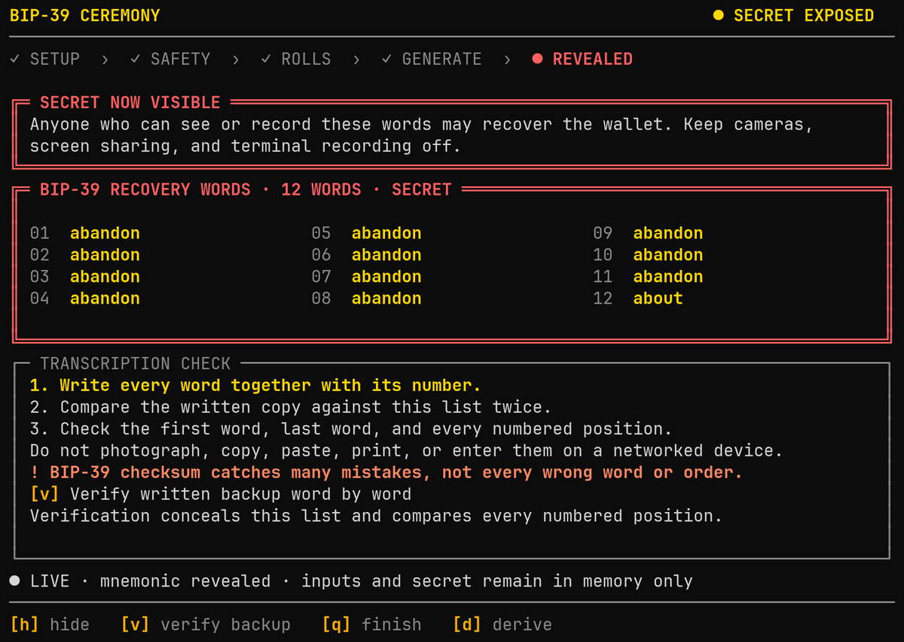

<div align="center">

# 🎲 BIP-39 Ceremony

**A glass-box Rust TUI for turning physical dice rolls and coin flips into
standard 12- or 24-word English BIP-39 mnemonics.**

[](LICENSE)
&nbsp;
&nbsp;
&nbsp;
&nbsp;
&nbsp;
&nbsp;

<br>



<sub><i>Setup → safety → dice capture → reveal → derivation. (Demo uses the all-zero test vector; no real seed is shown.)</i></sub>

</div>

## 🎯 Purpose

The primary goal is to make the entropy pipeline understandable and
independently inspectable—not merely to generate a mnemonic. The ceremony shows
how an ordered physical outcome sequence is converted into entropy, checksum
bits, word indices, and final words. It keeps the entropy accounting explicit:
conversion and hashing can transform or condition the observations, but cannot
create entropy.

The implementation follows the same goal. Calculations are isolated in the
independent [`bip39-ceremony-core`](crates/bip39-ceremony-core/) crate so they are
easy to read, test, verify, and reuse without the terminal interface.

## 🔍 What you can inspect

After deliberate reveal, the TUI exposes:

- the entered roll or flip sequence and protocol-specific grouping;
- conversion details, including rejection decisions where applicable;
- the resulting entropy bits and BIP-39 checksum;
- each 11-bit word index and its corresponding English word.

<table>
<tr>
<td width="50%">

<br><sub><i>Physical capture: numbered positions, a live running hash, and the
zero-padded ledger (hidden by default; toggle with <code>h</code>).</i></sub>
</td>
<td width="50%">

<br><sub><i>Deliberate reveal: the numbered word grid gates behind an explicit
step, with transcription and backup-verification guidance.</i></sub>
</td>
</tr>
</table>

## 🛡️ Security boundary

Rolls, flips, entropy, intermediate derivations, and mnemonic words are
wallet-secret material. Prefer a trusted offline computer and local terminal.
The program avoids persistence and zeroizes owned secret buffers, but cannot
protect a compromised OS, swap, terminal recording, screenshots, or observers.

## 🚀 Quick start

The repository pins Rust and audit tooling through Nix:

```sh
direnv allow       # automatic `nix develop`
# or: nix develop
just hooks         # install the repository pre-commit hook
just run
```

## 🎲 Conversion protocols

| Protocol | 🎯 Target | Input | Basis & notes |
| --- | :---: | --- | --- |
| **COLDCARD** | 12 · 24 | D6 | SHA-256 over ASCII roll digits, compatible for an identical ordered sequence. Minimums are 50 rolls for 12 words and COLDCARD's documented 99 rolls for 24 words; additional rolls are accepted. |
| **Word-by-word Exact** | 12 · 24 | D6 | Exact localized rejection over six-roll 11-bit candidates and a final entropy-tail candidate. Minimums are 70 or 140 rolls; rejected groups never discard accepted positions. |
| **Exact** | 12 · 24 | D6 | Exact base-6 rejection mapping. Uniform under independent fair dice; ~16% of 50-roll and ~11% of 100-roll attempts reject. |
| **Keystone legacy dice** | 24 | D6 | 24-word compatibility profile that maps face `6` to ASCII `0`, permits completion from 50 mapped rolls, recommends continuing to 99, and uses the full digest. |
| **Jade direct words** | 12 · 24 | D16/D8 | D16/D16/D8 triples select the first 11 or 23 BIP-39 indices using [Blockstream's published table order][jade-guide]. A final D16/D8 or D8 roll supplies the remaining entropy bits before checksum calculation. |
| **BitBox02 Diceware** | 12 · 24 | D6 + coin | Reproduces BitBox02's external printed-table workflow; the firmware does not capture the dice rolls. Five D6 faces accepted only in `1`–`4` plus one coin side select each direct word using the [published table][bitbox-guide]. Rejected `5`/`6` retry locally; final coins supply the entropy tail before the words are entered on the device. |
| **Krux D20** | 12 · 24 | D20 | At least 30 or 60 D20 rolls serialized as hyphen-separated decimal faces, matching [Krux's documented implementation][krux-guide]. Additional rolls are accepted before hashing with SHA-256. |
| **Coin + four-D6 direct words** | 12 | D6 + coin | One coin and four ordered D6 faces select each direct index using the pinned [Bip39-diceware table][coin-four-d6-table]. Whole rejected candidates retry; 12 accepted candidates provide 128 entropy bits before deterministic checksum replacement. |
| **SeedSigner coin flips** | 12 · 24 | Coin | Exactly 128 or 256 physical flips serialized as ASCII `0`/`1`, hashed with SHA-256, then truncated for 12 words when needed. |

[jade-guide]: https://help.blockstream.com/blockstream-jade/add-more-security-functionality/create-a-recovery-phrase-using-dice
[bitbox-guide]: https://blog.bitbox.swiss/en/roll-the-dice-generate-your-own-seed/
[krux-guide]: https://selfcustody.github.io/krux/getting-started/usage/generating-a-mnemonic/
[coin-four-d6-table]: https://github.com/taelfrinn/Bip39-diceware/blob/5320c9978fe89b5e068f6c0cafe45effe900e74c/README.md

All selectable protocols produce ordinary BIP-39 output. The protocol matters
only when reproducing a mnemonic from its original rolls. The frozen
`native-hash-v1` implementation and vectors remain in the source for protocol
compatibility, but it is no longer offered as a ceremony choice.

## 🎨 Visual themes

The warm `ember` palette is the sole visual theme. It preserves the terminal's
background and uses gold, amber, and coral for semantic emphasis. Run
`just run-plain`, set `BIP39_CEREMONY_THEME=plain`, or use a non-empty `NO_COLOR`
for the structurally equivalent colorless presentation. `TERM=dumb` also selects
plain mode. Labels, symbols, selection markers, and secret warnings remain
complete without color.

The interface normally uses one full-height workspace card. Help and derivation
replace that card on demand. Protocol explanation is the deliberate exception:
the selected protocol list remains in an upper card while its scrollable
explanation opens below, with a visible return control. Overflow stays inside
the workspace and is navigated with Page Up/Page Down. The phase path uses `✓`,
`●`, and `○` for complete, current, and future stages.

## 🏗️ Architecture and testing

Reusable capture values, versioned conversions, SHA-256 conditioning, BIP-39
encoding, and structured calculation evidence live in the publishable
[`bip39-ceremony-core`](crates/bip39-ceremony-core/) workspace library. It has no
ceremony, presentation, or terminal dependencies. Protocol-mandated
cryptography is concrete so callers cannot substitute an incompatible hash
while retaining a compatibility label.

The unpublished application owns the event-sourced `Ceremony`, safety and reveal
policy, explanatory wording, and terminal interface. Unit tests cover pure
calculation and domain paths, while consumer-style vector tests verify the core
crate's public boundary.

## Reference validation


Every wallet-compatible profile is cross-checked against the wallet's own
**executable** code — not just its published example — pinned by revision and
content hash in `flake.lock`:

**COLDCARD · SeedSigner · Krux · BitBox02 · Keystone · Jade · Ian Coleman**

| Upstream (pinned) | Executed and compared at | `just` check |
| --- | --- | --- |
| **COLDCARD firmware** | dice count, 30% distribution rejection, ASCII SHA-256, target truncation | `reference-coldcard` |
| **SeedSigner** (+ `embit 0.8.0`) | `generate_mnemonic_from_coin_flips` coin-flip helper | `reference-seedsigner` |
| **Krux v26.08.0** | `DiceEntropy.new_key`: minimum gate, decimal-hyphen serialization, SHA-256, truncation | `reference-krux` |
| **BitBox02 firmware v9.26.4** | checksum-completion candidates + entropy-tail ordering | `reference-bitbox` |
| **Keystone** (legacy Android) | 50/98/99-roll completion branches, face `6`→`0` mapping, SHA-256 | `reference-keystone` |
| **Jade firmware 1.0.40** (+ pinned libwally) | `valid_final_words` checksum + final-word ordering | `reference-jade` |
| **Ian Coleman BIP-39** | entropy → English encoder (shared BIP-39 boundary) | `reference-iancoleman` |

Only executable upstream code counts as a reference. Project-owned protocols
without an upstream oracle (Exact, Word-by-word Exact, and the static Coin +
four-D6 table) are instead held to pinned in-repo vectors under
[`crates/bip39-ceremony-core/tests/`](crates/bip39-ceremony-core/tests/).

The suite is grouped by upstream authority under
[`tests/references/`](tests/references/); each implementation owns its loading,
vectors, and assertions, while a shared harness holds the core driver and its
typed accepted/rejected/invalid/error wire protocol. Nix exposes each check
independently and composes them in `reference-implementations`. Run the
aggregate with `just reference-validation` (also part of the host-wide
`just release-feasibility`), or a single comparison with `just reference-jade`
and its `reference-coldcard`, `reference-seedsigner`, `reference-krux`,
`reference-bitbox`, `reference-keystone`, `reference-iancoleman` siblings.

## 🧰 Development environment

Useful commands inside `nix develop` or direnv:

```sh
just                     # list commands
just check               # format, Clippy, tests, package and privacy lint
just security            # RustSec, licenses, sources and duplicate versions
just precommit           # complete local gate
just build               # debug binary
just release             # local optimized build; not a release artifact
just reference-validation # compare against pinned upstream implementations
just release-gnu         # Nix GNU/Linux feasibility artifact and PTY smoke
just release-musl        # Nix static-musl feasibility artifact and PTY smoke
just release-feasibility # build and test all host feasibility outputs
just guix-lock-lint      # compare Guix crate origins with Cargo.lock
just deps                # reviewed normal dependency graph
```

The supported first-iteration platforms are Linux and macOS. The flake's package
outputs are release-feasibility probes, not an accepted release pipeline or an
independent reproducibility claim. On Linux, `gnu` tests dynamic glibc linkage
and `musl` tests static PIE linkage; both consume hash-checked Cargo inputs from
`Cargo.lock` and run the real test suite during their Nix builds.
